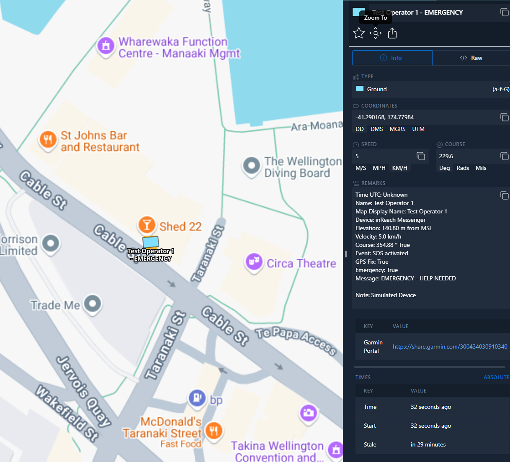

# ETL-InReach

<p align='center'>Garmin InReach or EverywhereHub Location data</p>

## Data Source

[Garmin InReach](https://www.garmin.com/en-NZ/c/outdoor-recreation/satellite-communicators/)

## Example Data



### Configuration

#### Real Devices
Configure `INREACH_MAP_SHARES` with your Garmin InReach MapShare URLs:

```json
{
  "INREACH_MAP_SHARES": [
    {
      "ShareId": "your-share-id-or-url",
      "CallSign": "Operator Name",
      "Password": "optional-password",
      "CoTType": "a-f-G"
    }
  ]
}
```

#### Test Mode
For development, testing or training without physical devices, enable test mode:

```json
{
  "TEST_MODE": true,
  "TEST_DEVICES": [
    {
      "IMEI": "300434030910340",
      "Name": "Test Operator 1",
      "DeviceType": "inReach Mini",
      "StartLat": -41.29,
      "StartLon": 174.78,
      "MovementPattern": "random_walk",
      "Speed": 5,
      "EmergencyMode": false,
      "MessageInterval": 10,
      "CoTType": "a-f-G"
    },
    {
      "IMEI": "300434030910341",
      "Name": "Emergency Test",
      "DeviceType": "inReach Explorer",
      "StartLat": -41.30,
      "StartLon": 174.79,
      "MovementPattern": "stationary",
      "Speed": 0,
      "EmergencyMode": true,
      "MessageInterval": 5,
      "CoTType": "a-f-G"
    }
  ]
}
```

**Movement Patterns:**
- `stationary`: Fixed position with GPS jitter
- `random_walk`: Random movement within radius
- `circular`: Circular movement pattern
- `linear_path`: Linear movement along path

**Device Types:**
- `inReach Mini`
- `inReach Explorer`
- `inReach SE+`
- `inReach Messenger`

## Deployment

Deployment into the CloudTAK environment for ETL tasks is done via automatic releases to the TAK.NZ AWS environment.

Github actions will build and push docker releases on every version tag which can then be automatically configured via the
CloudTAK API.

### GitHub Actions Setup

The workflow uses GitHub variables and secrets to make it reusable across different ETL repositories.

#### Organization Variables (recommended)
- `DEMO_STACK_NAME`: Name of the demo stack (default: "Demo")
- `PROD_STACK_NAME`: Name of the production stack (default: "Prod")

#### Organization Secrets (recommended)
- `DEMO_AWS_ACCOUNT_ID`: AWS account ID for demo environment
- `DEMO_AWS_REGION`: AWS region for demo environment
- `DEMO_AWS_ROLE_ARN`: IAM role ARN for demo environment
- `PROD_AWS_ACCOUNT_ID`: AWS account ID for production environment
- `PROD_AWS_REGION`: AWS region for production environment
- `PROD_AWS_ROLE_ARN`: IAM role ARN for production environment

#### Repository Variables
- `ETL_NAME`: Name of the ETL (default: repository name)

#### Repository Secrets (alternative to organization secrets)
- `AWS_ACCOUNT_ID`: AWS account ID for the environment
- `AWS_REGION`: AWS region for the environment
- `AWS_ROLE_ARN`: IAM role ARN for the environment

These variables and secrets can be set in the GitHub organization or repository settings under Settings > Secrets and variables.

### Manual Deployment

For manual deployment you can use the `scripts/etl/deploy-etl.sh` script from the [CloudTAK](https://github.com/TAK-NZ/CloudTAK/) repo.
As an example: 
```
../CloudTAK/scripts/etl/deploy-etl.sh Demo v1.0.0 --profile tak-nz-demo
```

### CloudTAK Configuration

When registering this ETL as a task in CloudTAK:

- Use the `<repo-name>.png` file in the main folder of this repository as the Task Logo
- Use the raw GitHub URL of this README.md file as the Task Markdown Readme URL

This will ensure proper visual identification and documentation for the task in the CloudTAK interface.

## Development

TAK.NZ provided Lambda ETLs are currently all written in [NodeJS](https://nodejs.org/en) through the use of a AWS Lambda optimized
Docker container. Documentation for the Dockerfile can be found in the [AWS Help Center](https://docs.aws.amazon.com/lambda/latest/dg/images-create.html)

```sh
npm install
```

Add a .env file in the root directory that gives the ETL script the necessary variables to communicate with a local ETL server.
When the ETL is deployed the `ETL_API` and `ETL_LAYER` variables will be provided by the Lambda Environment

```json
{
    "ETL_API": "http://localhost:5001",
    "ETL_LAYER": "19"
}
```

To run the task, ensure the local [CloudTAK](https://github.com/TAK-NZ/CloudTAK/) server is running and then run with typescript runtime
or build to JS and run natively with node

```
ts-node task.ts
```

```
npm run build
cp .env dist/
node dist/task.js
```